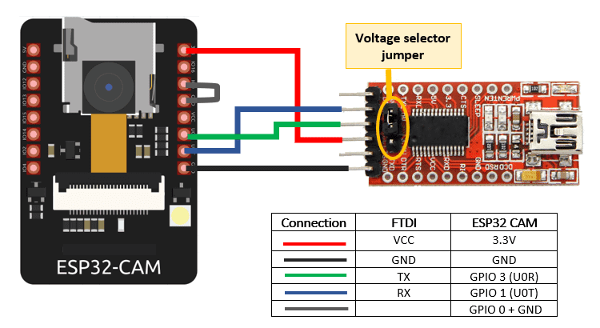

# ESP32CAM-RTSP :video_camera:

[](https://github.com/rzeldent/esp32cam-rtsp/actions/workflows/main.yml)

Simple [RTSP](https://en.wikipedia.org/wiki/Real_Time_Streaming_Protocol), [HTTP JPEG Streamer](https://en.wikipedia.org/wiki/Motion_JPEG) and image server with configuration through the web interface.

Flashing this software on a ESP32CAM module will make it a **RTSP streaming camera** server, a **HTTP Motion JPEG streamer** and a **HTTP image server**.

Supported protocols

- :white_check_mark: RTSP 
  The RTSP protocol is an industry standard and allows many CCTV systems and applications (like for example [VLC](https://www.videolan.org/vlc/)) to connect directly to the ESP32CAM camera stream.
  It is also possible to stream directly to a server using [ffmpeg](https://ffmpeg.org).
  This makes the module a camera server allowing recording and the stream can be stored on a disk and replayed later.
  The URL is rtsp://&lt;ip address&gt;:554/mjpeg/1

- :white_check_mark: HTTP Motion JPEG
  The HTTP JPEG streamer makes it possible to watch the camera stream directly in your browser.
  The URL is http://&lt;ip address&gt;/stream

- :white_check_mark: HTTP image
  The HTTP Image returns an HTTP JPEG image of the camera.
  The URL is http://&lt;ip address&gt;/snapshot


The software provides a **configuration web server**, that can be used to:

- Provide information about the state of the device, wifi connection and camera,
- Set the WiFi parameters,
- Set the timeout for connecting to the access point,
- Set an access password,
- Select the board type,
- Select the image size,
- Select the frame rate,
- Select the JPEG quality
- Enable the use of the PSRAM
- Set the number of frame buffers
- Configure the camera options

The software provides contains also a mDNS server to be easily discoverable on the local network.
It advertises HTTP (port 80) and RTSP (port 554)

## Required

- ESP32-CAM module or similar,
- USB to Serial (TTL level) converter, piggyback board ESP32-CAM-MB or other way to connect to the device,
- [**PlatformIO**](https://platformio.org/) software (free download)


### Debian based systems command-line install

Install platformIO

```sh
 sudo apt-get install python-pip
 sudo pip install platformio
 pio upgrade
```

### Windows, Linux and MacOS

Install [**Visual Studio code**](https://code.visualstudio.com) and install the PlatformIO plugin.
For command line usage Python and PlatformIO-Core is sufficient.


### FTDI adapter

When using an FTDI adapter, make sure the adapter is set to 3.3 volt before connecting. Use the wiring schema below.



After programming remove the wire to tge GPIO0 pin to exit the download mode.


### Using Visual studio

Open the project in a new window. Run the following tasks using the ```Terminal -> Run Task``` or CTRL+ALT+T command in the menu (or use the icons below on the toolbar). Make sure the ESP32-CAM is in download mode during the uploads.

- PlatformIO: Build (esp32cam)
- PlatformIO: Upload (esp32cam)

To monitor the behavior run the task, run: ```PlatformIO: Monitor (esp32cam)```

## Issues / Nice to know

- The red LED on the back of the device indicates the device is not connected.
- Sometimes after configuration a reboot is required.
  If the error screen is shown that it is unable to make a connection, first try to reboot the device,
- When booting, the device waits 30 seconds for a connection (configurable).
  You can make a connection to the SSID and log in using the credentials below,
- When connected, go to the ip of the device and, when prompted for the credentials, enter 'admin' and the AP password.
  This is a **required** field before saving the credentials,
- When the password is lost, a fix is to completely erase the ESP32 using the ```pio run -t erase``` command.
  This will reset the device including configuration.
  If using the esptool, you can do this using ```esptool.py --chip esp32 --port /dev/ttyUSB0 erase_flash```.
  However, after erasing, re-flashing of the firmware is required.
- When finished configuring for the first time and the access point is entered, disconnect from the wireless network provided by the device.
  This should reset the device and connect to the access point.
  Resetting is also a good alternative...
- There are modules that have no or faulty PSRAM (despite advertised as such).
  This can be the case if the camera fails to initialize.
  It might help to disable the use of the PSRAM and reduce the buffers and the screen size.

### Power

Make sure the power is 5 volts and stable, although the ESP32 is a 3.3V module, this voltage is created on the board.
If not stable, it has been reported that restarts occur when starting up (probably when power is required for WiFi).
The software disables the brown out protection so there is some margin in the voltage.
Some people suggest to add a capacitor over the 5V input to stabilize the voltage.

### Camera module

Be careful when connecting the camera module.
Make sure it is connected the right way around (Camera pointing away from the board) and the ribbon cable inserted to the end before locking it.

### Our Product

this is our product


